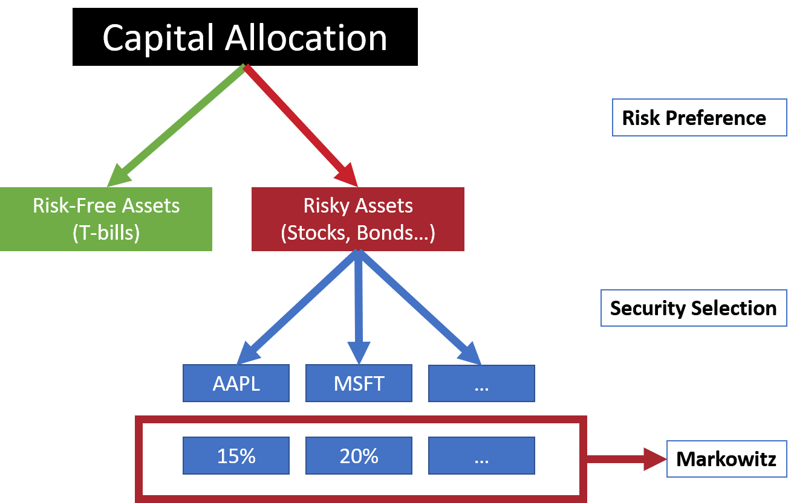
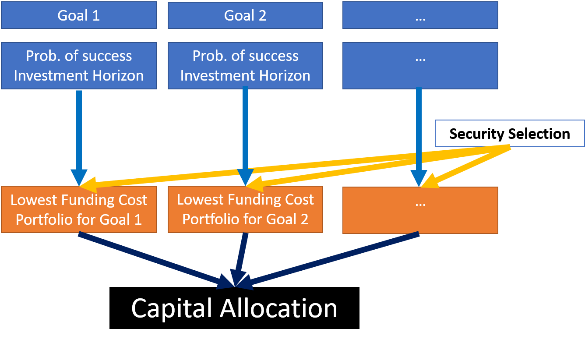

Unlike institutional investors, individual investors usually have multiple goals to archive or avoid. These goals can span over various time horizons. 
Individual investors also focus more on the probability of missing a goal, instead of the return volatility tradeoff concerned by institutional investors.

|                        | Institutional Investors | Individual Investors |
|------------------------|-------------------------|----------------------|
| Major Purpose (goal)   | Single                  | Multiple             |
| Time Horizon           | Single                  | Multiple             |
| Liabilities - Number   | Large                   | Small                |
| Liabilities - Individual Size | Small           | Variable             |
| Tax Status             | Mostly tax-exempted     | Mostly taxable       |
| Asset Size             | Mostly very large       | Variable             |
| Risk Measure           | Return and risk         | Probability of missing/succeeding a goal |
| Return Determination   | Average expectations    | Minimum outcome      |
| Risk Determination     | Top down                | Bottom up            |

### Workflow: Institutional Investors

Below is the top-down approach used by instititional investors. In the first step, capital allocation between risk-free assets and risky assets is determined by risk preference.

Within risky assets such as bonds and stocks, insititutional investors need to select securities according to investment policy.

Once securities are selected, optimization tools such as Markowitz can help determine the weights of each risky assets.

### Workflow: Individual Investors

Individual investors adopt a bottom-up approach for asset allocation, as illustrated in the chart below.

Goals-based wealth management provides a framework to help individual investors allocate their assets to meet their goals in a logical and consistent way.
We illustrate the workflow with an example.

## Mean-Variance Framework

Both approaches are based on the mean-variance framework pioneered by Markowitz. We will start by introducing the standard mean-variance portfolio optimization framework. We will then discuss how goals-based investment is based on the mean-variance framework.

### Mean-Variance Portfolio Optimization

Assume that we have $N$ risky asset classes and we would like to create a portfolio with them.

Let

$$
\mathbf{\mu}=\left[\mu_1,\mu_2,\dots,\mu_N\right]',
$$

$$
\mathbf{w}=\left[w_1,w_2,\dots,w_N\right]',
$$

and

$$
\mathbf{q} = \left[q_1,q_2,\dots,q_N\right]',
$$

where $\mu$, $\mathbf{w}$, and $\mathbf{q}$ are $N\times1$ column vectors of expected returns, portfolio weights, and asset class liquidity measure respectively.

We also have the variance-covariance matrix of asset returns as

$$
\mathbf{\Sigma}=\left[
\begin{matrix}
\sigma_1^2&\sigma_{12}&\cdots&\sigma_{1N}\\
\sigma_{21}&\sigma_2^2&\cdots&\sigma_{2N}\\
\cdots & \cdots&\cdots&\cdots\\
\sigma_{N1}&\cdots&\cdots&\sigma_N^2\\
\end{matrix}
\right].
$$

For portfolio weights, the following condition must be met (the budget constraint):

$$1=\sum_{j=1}^N{w_j}=\mathbf{w'e},$$

where $\mathbf{e}=\left[1, 1, \dots, 1\right]'$ as an $N\times1$ vector of ones.

There can be other linear equality constraints so that

$$
\mathbf{A}_E\mathbf{w}=\mathbf{b}_E,
$$

where $\mathbf{A}_E$ is the linear equality constraint matrix of size $N_E\times N$, and $\mathbf{b}_E$ is the linear equality constraint vector of size $N_E\times N$.

There can also be linear inequality constraints so that

$$
\mathbf{A}_l\mathbf{w}\le \mathbf{b}_l,
$$

where $\mathbf{A}_l$ is the linear inequality constraint matrix of size $N_l\times N$, and $\mathbf{b}_l$ is the linear inequality constraint vector of size $N_l\times1$.

For each asset class weight in a module, there may also be some bound constraints:

$$
\mathbf{L}_B\le\mathbf{w}\le\mathbf{U}_B,
$$

where $\mathbf{L}_B$ is the lower bound constraint vector of size $N\times 1$, and $\mathbf{U}_B$ is the upper bound constraint vector of the same size.

Sometimes there are group constraints so that the weight of a group of asset classes has to be within a certain range:

$$
\mathbf{L}_G\le\mathbf{Gw}\le\mathbf{U}_G,
$$

where $\mathbf{L}_G$ is the lower bound group constraint vector of size $N_G$, $\mathbf{U}_G$ is the upper bound group constraint vector of the same size, and $\mathbf{G}$ is the group membership index matrix of size $N_G\times N$. Each row of $\mathbf{G}$ contains dummy variable 1s or 0s to indicate whether an asset class is included.

There can also be group ratio linear constraints so that the weight of a sub-group of asset classes has to be within a certain range of a group of asset classes:

$$
\mathbf{L}_R^i\left(\mathbf{G}_B\mathbf{w}\right)_i
\le
\left(\mathbf{G}_A\mathbf{w}\right)_i
\le
\mathbf{U}_R^i
\left(\mathbf{G}_B\mathbf{w}\right)_i,
$$

for $i=1,\dots,N_R$ where $\mathbf{L}_R$ is the vector of lower bound group ratio constraint vector of size $N_R\times1$, $\mathbf{U}_R$ is the vector of upper bound group ratio constraint vector of the same size, $\mathbf{G}_A$ is the sub-group membership index matrix of size $N_R\times N$, and $\mathbf{G}_B$ is the group membership index matrix of size $N_R\times N$. Each row of $\mathbf{G}_A$ and $\mathbf{G}_B$ contains contains dummy variables 1s and 0s to indicate group and sub-group membership.

In the mean-variance framework, the portfolio expected return:

$$
\mu_p=\sum_{j=1}^N{w_j\mu_j}=\mathbf{w'\mu}.
$$

The portfolio variance is defined as

$$
\sigma_p^2=\sum_{j=1}^N{\sum_{k=1}^N{w_jw_k\sigma_{jk}}}=\mathbf{w'\Sigma w}.
$$

The utility function is

$$
U=\mu_p-\frac12\gamma\sigma_p^2=\mathbf{w'\mu}-\frac\gamma2\mathbf{w'\Sigma w},
$$

which is in quadratic form with the risk aversion parameter  $\gamma\ge0$. The more the investor hates risk, the higher this parameter becomes.

To optimize a portfolio, we actually maximize utility:

$$
\text{arg max}\left|U=\mathbf{w'\mu}-\frac\gamma2\mathbf{w'\Sigma w},\right.
$$

subject to the aforementioned constraints.

The two ends of an efficient frontier are generated by setting $\gamma=0$ for the global minimum variance portfolio (i.e., the lower end of the efficient frontier), and letting $\gamma\rightarrow\infty$  for the other end of the efficient frontier.

Maximizing utility is a typical quadratic programming problem that can be solved with PortNox.

### Time-and-Probability-Adjusted Expected Return (Minimum Return)

In the mean-variance framework, investors choose portfolios according to risk-return tradeoff by combining efficient frontier with their utility function. Nevertheless, since individuals worry about the chance of missing a goal over its horizon, their measure of risk is thus time-and-probability-adjusted expected return (aka minimum return). The figure below shows both minimum and expected portfolio return when it is assumed to follow a normal distribution.

To interprete the figure, we can view the expected return as the minimum return with a 50% probability of success, as the distribution is symmetric. The return, with a probability of success of 90%, is the 10% quantile of the probability density function of the normal distribution.

More formally, if the module expected return is assumed to follow normality, it is easy to translate the expected return into a minimum required rate of return over the time horizon $T$ by using the following formula with the inverse of normal cumulative function:

$$
r\left(p,\mu,\sigma,T\right)=\exp\left[F^{-1}(1-p,\mu'T,\sigma'\sqrt{T})/T\right]-1,
$$

where $p$ is the probability of reaching the goal, $\mu'=\log(1+\mu)$ is the continuously portfolio expected return, and $\sigma'=\sqrt{\log\left[\sigma^2/(1+\mu)\right]^2+1}$ is its volatility, with

$$
F(x|\mu,\sigma)=\frac1{\sigma\sqrt{2\pi}}\int_{-\infty}^x{e^{\frac{-\left(t-\mu\right)^2}{2\sigma^2}}dt}.
$$

Below is a calculator to illustrate the concept.

  
  
    <label for="txtR">Expected Return (%)</label>
    <input type="number" id="txtR" placeholder="Expected Return (%)"></input>
     
    <label for="txtV">Volatility (%)</label>
    <input type="number" id="txtV" min="0" placeholder="Volatility (%)"></input>
     
    <select id="selectDropdown">
      <option value="">--Please choose an option--</option>
      
    </select>
  

  

    <label for="readonlyTextbox">Minimum Expected Return with 50% Probability of Success (%) </label>
    <input type="text" id="readonlyTextbox" readonly>
  

### Maximum Expected Drawdown

Investors may also have concerns about the maximum expected drawdown of a portfolio, which measures how severe the loss can be from pick to trough over a specific investment horizon.
By assuming that the continuous portfolio expected return follows a Brownian motion, Malik, Amir, Amrit and Yaser (2004) provide an analytical solution to compute the maximum expected drawdown.

## Goals

Understanding what individual investors really want is crucial in goals-based wealth investment. There are two types of goals. The first type depends on specific discounted cash flows, while the second involves aspiration. A cash flow-driven goal is also associated with a required probability of success and a time horizon.

For example, a family spends $500,000 on average per year. They want a 95% chance to keep meeting their lifestyle expenses for the next 5 years. This is a cash flow-driven goal. As another example, the same family has some pillow money that they want to put aside. So there is no specific probability of success or investment horizon involved, it is an aspiration-driven goal.
The required probability of success is important. Nevertheless, for human beings, it is easier and more institutive to describe the importance of a goal in words than an exact number. Brunel (2015a) suggests the following table to associate probabilities with words.

| To achieve | To Avoid | Probability of Success |
| -------- | -------- | -------- |
| Dreams  | Concerns  | 50%, 55%, or 60%  |
| Wishes  | Worries  | 65%, 70%, or 75%  |
| Wants  | Fears  | 80%, or 85%  |
| Needs | Nightmares  | 90%, 95%, or 99%  |

According to the table, to create a goal, we can ask a client the purpose of the goal. For example, is the goal to achieve dreams, wishes, wants or needs, or to avoid concerns, worries, fears or nightmares? The purpose of a goal is directly linked to its required probability of success $p$ . A need means a higher required probability of success than a dream.

### Cashflow Driven Goals

The first type of goal is called cashflow-driven goals. They are created by setting the net present value (NPV) of a cash flow stream to zero:

$$
NPV(p, T)=\sum_{t=1}^T{\frac{C_t}{\left(1+r\right)^t}}-C_0=0,
$$

where $C_t$ is the cashflow in year $t$, $T$ is the investment horizon, $r$ is the minimum required rate of return for $T$ and the required probability of success $p$, and $C_0$ is the funding cost.

Here $r$ is the internal rate of return as it makes the net present value zero. Since module expected returns and volatility are mapped to the internal rate of returns, we can calculate the funding cost $C_0$  for each cashflow-driven goal. To match a cashflow-driven goal, we simply need to pick the module which yields the lowest funding cost.

### Aspiration-Driven Goals

Aspiration-driven goals are usually used for the surplus of a client’s investable assets once cash flow-driven goals are matched. These goals are not associated with a probability of success or a specific time horizon. Thus, they usually involve investing the surplus at the highest expected return given a set of modules.

## Workflow Guideline

### Management Workflow

The management workflow is rather straightforward.

#### Capital Market Assumptions

The management team should provide capital market assumptions for various asset classes, including the before and after-tax expected return, volatility, and liquidity of each asset. Here the liquidity is defined as 1 minus the year fraction required for a position to be liquidated without affecting market prices with a bound constraint between 0 and 1 (Brunel, 2015a). In this way, illiquid asset classes can have liquidity as low as zero, whereas liquid assets, such as cash, can have liquidity of 100%. In addition to the aforementioned items, the correlation matrix is also required.

A concept related to asset databases is asset database groups. An asset database group contains a collection of asset databases. These asset databases contain the same before-tax expected return, volatility, and liquidity of each asset. The difference is the tax efficiency coefficents. 

At this moment, PortNox only supports importing capital market assumptions from an Excel file with a single asset database under an asset database group. See [Road Map](https://github.com/KWIA-PortNox/Portnox-a01r01-MVP/discussions) for further development.

Once the capital market assumptions are uploaded, PortNox will check the validity of the following items:

* The correlation matrix needs to be (semi-) positive definite. This is crucial for the module editor to work, as one of the requirements of mean-variance portfolio optimization.

* The validity of mega groups is also checked with the following rules:

1) Every asset class needs to be in one and only one mega group.
2) Asset classes in a mega group must be unique.
3) All asset classes must be included in a mega group.

* There needs to be at least one valid set of range policies. Range policies are used in the tilting process. No matter how high or low tilting scores are, the weights of an asset class cannot be tilted beyond its range policy.

#### Module Creation

Once the capital market assumptions are given, the management team can create firm-managed modules. Each module is a mean-variance efficient portfolio with constraints that meet investment policies. In addition to weight constraints, a module can also have constraints on liquidity and expected maximum drawdown.

To create a module, we also need to provide its probability of success and investment horizon. This is especially useful when the objective of the module is set to maximize minimum return. In this way, we can easily create modules that will be automatically matched to goals with similar probabilities of success and horizons.

### Tilting

#### Gathering Tilting Inputs

In the first step, we need to set up a tilting score range. For example, Brunel (2015a) uses a score range between -3 and 3. A score of 3 means the user is really in favor of that asset class, whereas a score of -3 means the user tries to avoid that asset class completely.
Different members of an investment committee may have different voting power. So the final titling inputs are calculated as a weighted sum of all titling inputs.

Besides a titling score, we also need to set up a deviation range for each asset class and each asset class group.
Once the information is gathered, we can tilt the portfolio.

#### The Tilting Process

We first need to set a free asset class, such as cash, to make sure the sum of asset class weights is 100%.
The tilted weight range of any other asset class is defined as

$$
\left[L_{a,i},U_{a,i}\right] \equiv\left[\max\left(0,w_{a,i}-d_{a,i}/2\right), \min\left(1, w_{a,i}+d_{a,i}/2\right)\right],
$$

where $w_{a,i}$ is the optimized weight of the $i$ th asset class, $L_{a,i}$ is the lower bound, $U_{a,i}$ is the upper bound, and $d_{a,i}$ is its deviation range.

Suppose each asset class except the free asset class is in a mutually exclusive titling asset class group $g_m$, where $m=1,\dots M$  for $M$ groups.
The weight of $g_m$ is

$$
w_{g,m}=\sum{w_{a,i}},
$$

for all asset classes in the group.

This also means the weight of the free asset $a_f$ is $w_{a,f}=1-\sum_{w_{g,m}}$, where $m=1\dots M$.

Denote $d_{g,m}$ as the deviation range of $g_m$, $L_{g,m}$ as the lower bound, $U_{g,m}$ as the upper bound the allowed weight range of the asset class group $g_m$ is

$$
\left[L_{g,m},U_{g,m}\right]\equiv
\left[
\max\left(0,w_{g,m}-d_{g,m}/2\right), \min\left(1,w_{g,m}+d_{g,m}/2\right)
\right].
$$

In the tilting process, we follow the following procedure.

##### Step 1

In the first step, we calculate the tilted asset class weights as

$$
w_{a,i}^{'}=w_{a,i}+c_{a,i}d_{a,i}/r,
$$

where $c_{a,i}$ is the tilting input of the $i$ th asset class, and $r$ is the allowed tilting score range (for example, if tilting scores are allowed to vary between -3 and 3, then $r=6$).

The tilting input $c_{g,m}$ of the tilting asset class group $g_m$ is defined as

$$
c_{g,m}=\sum{w_{a,i}c_{a,i}}.
$$

There will be two tilted asset class group weights for each asset class group.
The first one is the result of explicitly applying tilting scores on $w_{g,m}$:

$$
w_{g,m}^{'}=w_{g,m}+c_{g,m}d_{g,m}/r,
$$

where $d_{g,m}$ is the deviation range of $g_m$.

There is also an implicit tilted asset class group weight, defined as

$$
w_{g,m}^{"}=\sum{w^{'}_{a,i}}.
$$

$w_{g,m}^{'}$ and $w_{g,m}^{''}$ do not usually equal after tilting.

##### Step 2

In the second step, we perform a minimax control to make sure that the tilted asset class weights are within the allowed range, so that

$$
\bar{w}'_{a,i}=\max{\left[
L_{a,i},\min\left(w^'_{a,i},U_{a,i}\right)
\right]}.
$$

### Financial Advisory Workflow

## Technical Details in PortNox Optimization Engines

### Optimization Engines

To optimize a module, depending on the objective function, one of the following engines are used.

|Optimization Target|Engine|Comment|
|:--|:--|:--|
|$\max{\mu}$ given $\sigma$ or $\min{\sigma}$ given $\mu$|QP|Global optimal solution|
|Target minimum return or maximum minimum return (optional) with a maximum expected drawdown threshold $D$|QP|Global optimal solution. We generate the whole efficient frontier with the number of portfolios spaced equally from minimum to maximum portfolio expected return, with a step size of 0.01%. Then we filter out the part of the efficient frontier with a drawdown greater than  $D$. When we calculate  $D$, we assume that portfolio follows a Geometric Brownian motion, and use $\log(1+\mu)-\sigma'^2/2$ as the drift term. Drawdown $D$ is the difference between the peak and trough. For a symmetric distribution, it is twice the difference between the beginning and trough. We then translate the efficient frontier based on given investment horizon and probability of success using Equation (14).|

Note: QP: Quadratic programming, TRDS: Trust region Doglet-Steihaug. At this stage, drawdown threshold is used as a filter on the mean-variance efficient frontier. In a future release, expected maximum drawdown will be used to serve as the risk measure in estimating efficient frontier.

##	Sensitivity Analysis Algorithm
### Module Sensitivity Analysis
####	Excluding an Asset Class/Group
After we obtain an optimized solution, we perform the sensitivity analysis to check the impact of excluding an asset class/group. We perform this analysis by setting the lower and upper bound of each asset class/group with non-zero optimal weight to zero and try to optimize the objective function. If by excluding an asset class/group the target objective is beyond the feasible range of the new efficient frontier, the software reports #N/A instead.
####	Relaxing Boundary Condition for an Asset Class/Group
After we obtain an optimized solution, we perform the sensitivity analysis to check the impact of removing the weight constraint on an asset class/group. We run this analysis by setting the lower and upper bound of each asset class/group with non-zero optimal weight to   and  .
Since relaxing a weight constraint will yield a broader efficient frontier, there is no need to check whether the new result is within the feasible range of the efficient frontier.
####	Changing of Liquidity Threshold 
The liquidity threshold varies from [0%, 100%] to [100%, 100%] with a step size of 10%. 
#### Changing the Probability of Success
If the objective function is minimum return, the software checks the impact of changing the probability of success $p$  to $p\mp 10\\%$ .
####	Changing the Investment Horizon
If the objective function is minimum return, the software checks the impact of changing the investment horizon $t$  to $t\mp1$  years.

## Reference

* Brunel, J.L.P. (2015a) Goals-Based Wealth Management – An Integrated and Practical Approach to Changing the Structure of Wealth Advisory Practice, Wiley, Hoboken, New Jersey.

* Brunel, J.L.P. (2015b) Goals-based wealth management in practice, Luxembourg CFA Conference, April 28, 2015.

* Goldberg, L.R., and Mahmoud, O. (2015) On a convex measure of drawdown risk, Center for Risk Management Research, University of California Berkeley, Working Paper # 2014 – 03.

* Malik, M., Amir, F.A., Amrit, P., and Yaser, S.A. (2004) On the Maximum Drawdown of a Brownian Motion, Journal of Applied Probabilities, Vol. 41(1), 147 – 161

