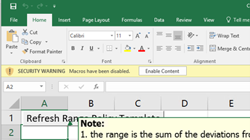
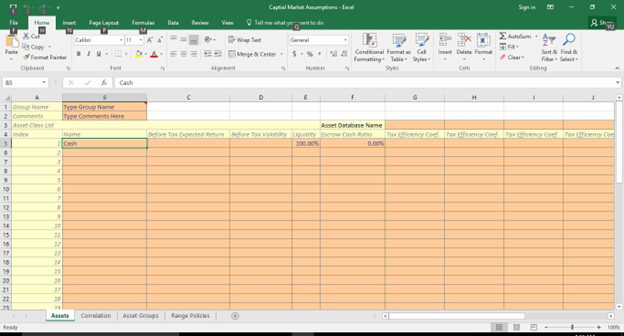

import Table  from '../../../components/Table.jsx';
import Latex from '../../../components/Latex.astro';
import LatexD from '../../../components/LatexD.astro';

_Note: This is the user manual for PortNox MVP. 
For technical details of mean-variance portfolio theory and goals-based investment analysis, 
refer to the technical document [here](../../mvp/technical-document/#mean-variance-portfolio-optimization)._

## Background

### Introduction

Suppose that a wealthy family has $25 million investable assets. Household spends $500K per year. The first generation is in their mid-fifties. 
Assume that the first generation have the following four goals:

1.	It is very important to keep their life style expenses for the next 5 years.
2.	They want to meet the same life style for the 20 years beyond.
3.	It is important to give $10 million to their children in 10 years.
4.	It is nice if they can fund a foundation with $10 million in 20 years.

#### Step 1 – Quantify the Goals

It is inevitable to deal with numbers. The first step is to associate the importance of the goals with probability, and check the cash flows. Table 1 associates the goals to probabilities of success.
Table 1 Goals for the Family

<Table caption='Goals for the Family' tableNumber='1'>
    <thead>
        <tr>
            <th>#</th>
            <th>Goal</th>
            <th>Horizon</th>
            <th>Importance</th>
            <th>Probability</th>
        </tr>
    </thead>
    <tbody>
        <tr>
            <td>Goal 1</td>
            <td>To maintain short-term life style</td>
            <td>5 years</td>
            <td>Very important</td>
            <td>95%</td>
        </tr>
        <tr>
            <td>Goal 2</td>
            <td>To maintain long-term life style</td>
            <td>20+ years</td>
            <td>Want to do</td>
            <td>85%</td>
        </tr>
        <tr>
            <td>Goal 3</td>
            <td>To pass wealth to the next generation</td>
            <td>10 years</td>
            <td>Important</td>
            <td>90%</td>
        </tr>
        <tr>
            <td>Goal 4</td>
            <td>To fund a foundation</td>
            <td>20 years</td>
            <td>Nice to do</td>
            <td>75%</td>
        </tr>
    </tbody>
    <tfoot>
      <tr>
        <td colspan='5'>
          Note: This table associates the goals of the family with required probability of success and investment horizons. A very important goal is associated with a 95% probability of success. An important goal requires 90% probability of success. A goal that the family wants to archive has a required probability of 85%. A goal that is nice to archive is assigned a required probability of success of 75%.
        </td>
      </tr>
    </tfoot>
</Table>

#### Step 2 – Analyze the Cash Flow Requirements

Suppose that the annual inflation is 2%. The cash flows are summarized in Table 2. The spending on Goal 1 is adjusted by the inflation.

<Table caption='Cash Flows of the Goals' tableNumber='2'>
    <thead>
        <tr>
            <th>Year</th>
            <th>Goal 1</th>
            <th>Goal 2</th>
            <th>Goal 3</th>
            <th>Goal 4</th>
        </tr>
    </thead>
    <tbody>
        <tr>
            <td>1</td>
            <td>\$ -500,000</td>
            <td>\$ -</td>
            <td>\$ -</td>
            <td></td>
        </tr>
        <tr>
            <td>2</td>
            <td>\$ -510,000</td>
            <td>\$ -</td>
            <td>\$ -</td>
            <td></td>
        </tr>      
        <tr>
            <td>...</td>
            <td>...</td>
            <td>...</td>
            <td>...</td>
            <td></td>
        </tr>             
        <tr>
            <td>5</td>
            <td>\$ -541,216</td>
            <td></td>
            <td></td>
            <td></td>
        </tr>
        <tr>
            <td>6</td>
            <td></td>
            <td>\$ -552,040</td>
            <td></td>
            <td></td>
        </tr>
        <tr>
            <td>7</td>
            <td></td>
            <td>\$ -563,081</td>
            <td>\$ -</td>
            <td>\$ -</td>
        </tr>        
        <tr>
            <td>...</td>
            <td>...</td>
            <td>...</td>
            <td>...</td>
            <td></td>
        </tr>            
        <tr>
            <td>10</td>
            <td></td>
            <td>\$ -597,546</td>
            <td>\$ -10,000,000</td>
            <td>\$ -</td>
        </tr>        
        <tr>
            <td>...</td>
            <td>...</td>
            <td>...</td>
            <td>...</td>
            <td></td>
        </tr>    
        <tr>
            <td>20</td>
            <td></td>
            <td>\$ -728,406</td>
            <td>\$ -10,000,000</td>
            <td></td>
        </tr>
        <tr>
            <td>T</td>
            <td>5</td>
            <td>20</td>
            <td>10</td>
            <td>20</td>
        </tr>
        <tr>
            <td>p</td>
            <td>95%</td>
            <td>85%</td>
            <td>90%</td>
            <td>75%</td>
        </tr>
    </tbody>
    <tfoot>
      <tr>
        <td colspan='5'>
        Note: This table lists the cash flows of the four goals of the family. The first goal has an investment horizon of 5 years. The second goal starts in Year 6 and ends in Year 20. Goal 3 is a lumpsum of $10 million in 10 years. Goal 4 is a lumpsum of $10 in 20 years. 
        The investment horizon <Latex formula='T'/> and required probability of success <Latex formula='p'/> are also shown.
        </td>
      </tr>
    </tfoot>
</Table>

####	Step 3 – Check Funding Costs Based on Modules 

The next step in goals based wealth management is to identify suitable investment strategies for these goals by taking their horizon and required probability of success into account. Optimized portfolios can be a logical choice to serve as investment strategies. In the program, the portfolios, or the investment strategies, are called modules.
For example, the following mean-variance optimized portfolios are available for the family to choose, as summarized in Table 3.

### Workflow for Asset Management

#### Working with Capital Market Assumptions Using Excel

It is often more convenient to enter this information using our Excel template. To do so:

1. Click **Download Sample Template** when you log in to https://ui.portnoxexp.io/
2. Save the template on your computer.
3. Open the saved workbook, which is a digitally signed macro-enabled workbook (.xlsm).

Warning: The template has fours worksheets. Please do not alter their names, change their orders, or modify their structures. Making any change to the VBA project will void the digital certificate and trigger a security warning the next time the file is opened. 

 

The first sheet is called Assets (Figure 11). Depending on the version you have, you can enter up to 50 asset classes. Starting from Cell B5, each row holds one asset class. 

For the whole asset database group, group name (Cell $B$1) and comments (Cell $B$2) are needed.

For each asset class, the following information is needed: asset class name, before tax expected return, before tax volatility, liquidity, escrow cash ratio, and at least one tax efficiency coefficient. You do not need to provide after tax expected return and volatility as they are calculated automatically using before tax data and the tax efficiency coefficient.

For each column of tax efficiency coefficients, you need to enter an asset database name. These asset databases will be grouped into an asset database group. Figure below shows an example with nine asset classes. There is only one asset database called AT Database 2017 (Cell G3 in the worksheet) as there is only one set of tax efficiency coefficients.

#### Board members’

#### Tilting Score studies

#### Range Policies

### Workflow for Financial Advisory

The task of financial advisors is to help their clients for goals-based wealth management. Once asset management tasks have been completed by the asset management team 
(i.e., capital market assumptions have been setup), financial advisors can work with their clients.

#### Client Profiles

To create a client profile, the financial advisor needs to enter the name, total wealth, default module for the surplus, and the tax status of a client. Optionally, a financial advisor can 
add tags for a client profile for identification and grouping. 

Once a client profile is created, the financial advisor can create cashflow-driven goals and aspiration driven goals.

##### Cashflow-Driven Goals

To create a cashflow driven goal, enter its name, purpose, term, investment horizon, 
probability of success and related cash flows. For example, the figure below shows a cashflow driven goal to spend $80,000 for the next 5 years with 
a probability of success of 95%. Once you enter the information, you can click “Validate” to check whether the client wealth can meet this goal. 
If the balance is nonnegative, you can save this goal.

##### Aspiration Driven Goals

To create an aspiration driven goal, simply choose the module to match manually, and specify how much initial capital required 
(as an absolute dollar amount, a percent of the total wealth, or a percent of surplus). Again, the balance must be nonnegative after creating an aspiration driven goal.

#### Client Groups

A client profile only supports a single tax status. It often happens that a family or a client has assets in different tax buckets. In that case, a financial advisor needs to create
a client profile per tax status.

It can also happen that several clients belong to the same family. To get the overview of the asset allocation situation of the whole family, it is useful to create 
a client group.

#### Reporting

## PortNox

### Log-In/Registration/Password Reset

PortNox can only be used after registration. The first time you use PortNox, go to https://ui.portnoxexp.io/, and click **Register Here** on the screen, as shown below:

Log In Screen

Registration Screen

You will need to fill in your first name, last name, your email address, and your password. Make sure you use a valid email address. Your account will only be activated after confirmation.

Also make sure your password contains a minimum of 8 characters of which at least one should be numeric and one alphabetic, at least one special character, at least one lower case character, and at least one upper case character.

At this moment, PortNox does not require email account verification. You can log in immediately after registration. However, after PortNox requires email verification (soon to be implemented), you will not be able to use PortNox until your account is activated.

### Working with PortNox

#### Overview

PortNox organizes information using the concept of asset databases. An asset database contains the following items:

1.	Capital market assumptions. The assumptions include information related to asset classes used in investment policies, for example, the expected return, volatility, liquidity, and tax efficiency coefficient of each asset class. The correlation matrix of the asset classes is also part of the assumptions. For an illiquid asset, it is also possible to provide an escrow cash ratio so cash is reserved at this ratio. Asset classes can also be grouped for group budget constraints in investment policies, or in the tilting process and reports. 
These asset groups are also part of capital market assumptions. Range policies for tilting purpose are also part of capital market assumptions. 

	Currently, PortNox only supports importing asset databases for Excel template (most user friendly). In future releases, PortNox will also allow users to edit capital market assumptions online.

    If a group of asset databases share the same underlying asset classes but with different tax efficiency coefficients, they can form an asset database group. Any change in the capital market assumptions in the group except tax efficiency coefficient will trigger a change in all capital markets in the same group.

2.	Once capital market assumptions are established, it is time to create firm-managed modules. A module is a mean-variance optimized portfolio based on asset class and asset group budget constraints (weights) and module constraints (liquidity, for example). 

    A module can be optimized based on one of the four objectives:

    a.	To maximize portfolio expected return <Latex formula='\mu_p'/> given a target volatility <Latex formula='\sigma_p'/>.

    b.	To minimize portfolio volatility <Latex formula='\sigma_p'/> given target portfolio expected return <Latex formula='\mu_p'/>.

    c.	To find the mean-variance optimized portfolio given time- and probability-adjusted portfolio expected return.

    d.	To find the mean-variance optimized portfolio with the highest time- and probability-adjusted portfolio expected return.

    Constraints on asset class weights, asset group weights, portfolio liquidity, investment horizon, and probability of success can be specified.

    Firm managed modules are available to all clients sharing the same asset database. In a later release of PortNox, client-specific modules will also be supported.

3.	Given optimized modules, a financial advisor can create client profiles and help clients to match their goals with appropriate modules. In addition:

    a.	Clients can be grouped into client groups. As client profiles only support single tax status, client groups can be useful for clients who have both taxable and tax-exempt goals. Financial advisors can also create ‘smart’ client groups.

    b.	Tilting policies based on board members’ inputs can be entered. Asset allocation can be tilted by combing tilting policies with range policies. 

    c.	PortNox can generate reports or run Monte Carlo simulations to check how the terminal wealth of clients looks like.

The whole workflow can be summarized in the following chart:

#### Capital Market Assumptions 

### Firm-Managed Module

Firm-managed modules are also called firm-wide modules. They are available to all clients in the same asset database (not asset database group). 

As explained in the technical document [here](../../mvp/technical-document/#mean-variance-portfolio-optimization), 
a mean-variance optimized portfolio is a portfolio that maximizes portfolio expected return given a target portfolio volatility, or minimizes portfolio volatility given a target portfolio expected return. A module also has a maximum expected drawdown. 

_Each cashflow driven goal has a probability of success and a time horizon. 
Therefore, we can calculate the minimum return of a module for a cashflow driven goal to be successful given the investment horizon._

#### Module Creation

To create a module, click **Modules** on the top panel, and then click **Create Module**, as shown below.

#### Step 1- General information

The first step is to enter the general information of a module, as shown below.

* Module Name: It has to be unique in the same asset database.
* Tax Status: It can be taxable or tax-exempt.
* Horizon: It is the investment horizon of the module, between 0 and 50 years.
* Probability of Success: It is the probability of success of the module, as one of the following: [65%, 70%, 75%, 80%, 85%, 90%, 95%, 99%].
* Escrow: It is the asset class that will be used as the escrow asset class for the module. It is used to reserve cash for illiquid assets.
* Categories: Here we can enter comma separated categories for the module. Categories are used to group modules for selection purpose.
* Minimum Liquidity: It is the minimum liquidity required for the module, between 0% and 100%.
* Maximum Liquidity: It is the maximum liquidity required for the module, between 0% and 100%. Maximum Liquidity must not be lower than the minimum liquidity.
* Escrow Cash %: This is the percentage of escrow cash required for the illiquidity, between 0% and 100%. 
For example, if the escrow cash ratio is 10%, and the module has an illiquid asset with a weight of 20%, then 2% of the total wealth will be reserved as cash.
* EMD Not Exeed: Not implemented yet.

_Notice that horizon and probability of success are not part of a mean-variance optimal portfolio. 
They are used to calculate minimum returns for cashflow driven goals. They help us to design modules that are likely to yield the highest minimum return given 
the required probability of success (<Latex formula='p'/> and horizon (<Latex formula='T'/>). 
So later when we create a cashflow driven goal with a certain <Latex formula='p'/> and <Latex formula='T'/>, 
the automatic match mode will likely to match it with a module designed for such a scenario. 
This is not always the case, as the asset management team has to make sure
modules are designed in such a way that they won't 'overstep' other modules for a specific <Latex formula='p'/> and <Latex formula='T'/>. 
But this is not a deal breaker to use PortNox. For one thing, it is easy to create a client-specif module (to be implemented soon). 
For another thing, we can always overwrite the chosen module if needed. Refer to the [case studies](../mvp/case-studies) for more details._

#### Step 2 – Constraints

Once we click **Next**, we will be taken to the constraints page, as shown below.

On the left hand side, we see the asset classes and their expected returns (<Latex formula='\mathbf{\mu}'/>), volatilities (<Latex formula='\mathbf{\sigma}'/>), 
and liquidities. Notice here <Latex formula='\mathbf{\mu}'/> and <Latex formula='\mathbf{\sigma}'/> depend on the tax status of the module.

On the right hand side, we see two panels. The top panel is for module-specific constraints. The bottom panel is for firm-wide constraints.

The panel of firm-wide constraints is used to set the minimum and maximum weights of asset groups defined in the capital market assumptions. 
They are prepopulated with the minimum and maximum weights of asset groups in the capital market assumptions. 
As PortNox does not support short sales yet, the boundaries are set to 0% and 100%.

There are four columns in the firmwide constraints table:

* Asset Group: It is the name of the asset group.
* Based on: By default, it is set to the overall module. If an asset group is also a subset of other asset groups, we can choose the asset database group that the asset group belongs to, like in the figure below.
* Minimum Weight: It is the minimum weight of the asset group.
* Maximum Weight: It is the maximum weight of the asset group.

If we need to add constraints of asset classes, or constraints of asset groups that are listed in the firmwide contraint table, we can use the panel of module-specific constraints.

Click on the dashed zone or the **Add Constraint** button

We will see the following panel. Here we can choose the asset class or asset group, and set the minimum and maximum weights. We can also choose the asset database group that the asset group belongs to.

We can add multiple module-specific constraints by clicking on the button **Add Constraint** again. Once we finish, click **Cancel** to go back to the previous page.

_Quick Tip: When you work in the tables, you can use the Tab key to move to the next cell. _

#### Step 3 – Portfolio Frontier Limits

In the third step, we can review the optimal portfolio limits based on the constraints imposed in the previous two steps:

The minimum and maximum values of the portfolio expected return, volatility, minimum return, and expected maximum drawdown are calculated based on the constraints.

Notice that the minimum return also takes the horizon and probability of success of the module into account.

#### Step 4 – Optimization

In the last step, we can choose the optimization optimal portfolio depending on three types of portfolio frontier:

* Maximum Return for a Given Volatility: This is the traditional mean-variance portfolio efficient frontier.
* Minimum Return for a Given Volatility: This is the minimum return for a given volatility.
* Expected Maximum Drawdown: This is the maximum drawdown for a given volatility.

PortNox will generate a chart for each type of portfolio frontier given the constraints. This allows us to easily choose an optimal portfolio.

The chart for the expected return for a given volatility is shown below.

By default, the module with the highest minimum return given the required probability of success and horizon is chosen. 
This is not necessarily the module with the highest expected return: it is the module that is to yield the highest minimum return given the required probability of success and horizon.

The panel on the right hand side shows the characterstics of the chosen module with asset class weights. 

_Note: In a future release, we will also support asset group weights, binding status, and shadow prices._

There are five buttons below the optimal portfolio frontier browser:

* Optimized: This is not available to a new module. It is only available to an existing module.
* Max. M.R.: (default) This is the module with the highest minimum return given the required probability of success and horizon.
* Min. Vol.: This is the global-minimum-variance portfolio.
* Max. Exp Return: This is the module with the highest expected return.
* Min. E.M.D.: This is the module with the lowest maximum expected drawdown.

### Client Profiles

### Client Groups

### Titling Policies

### Simulation/Scenario Analysis

